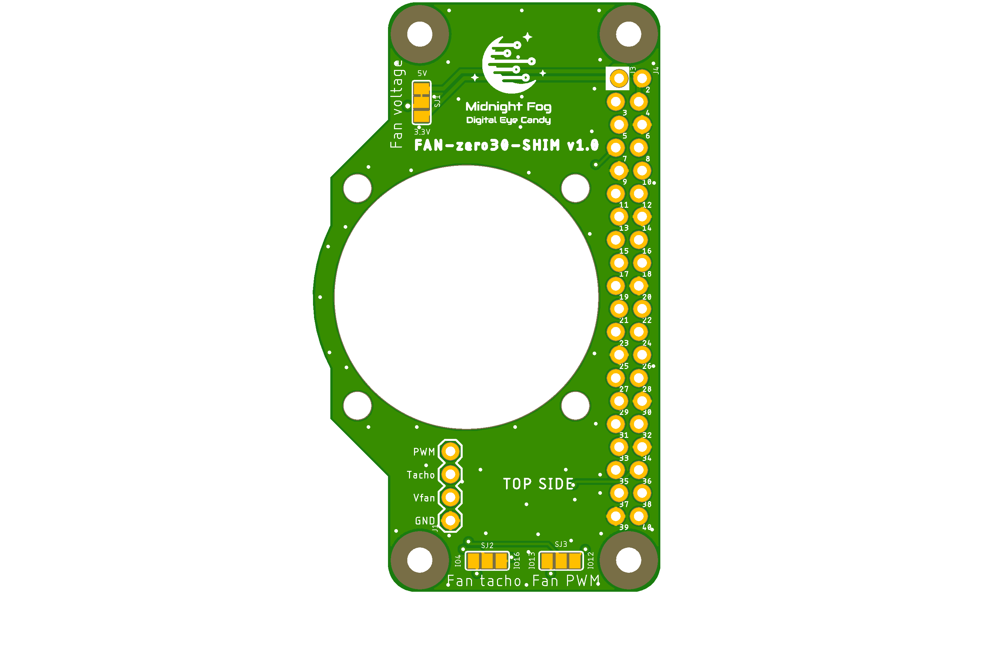
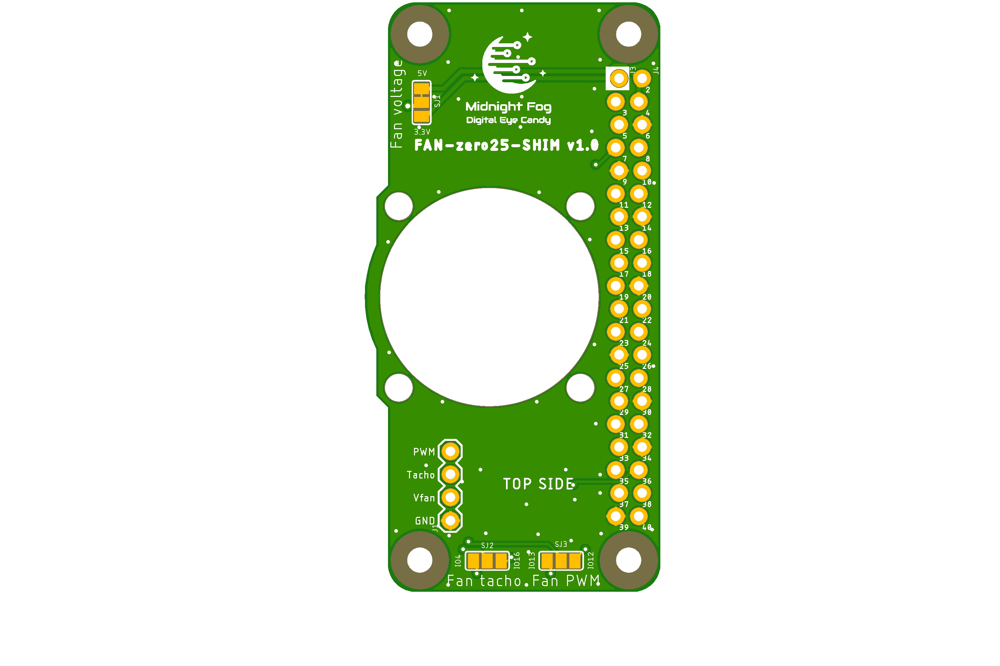
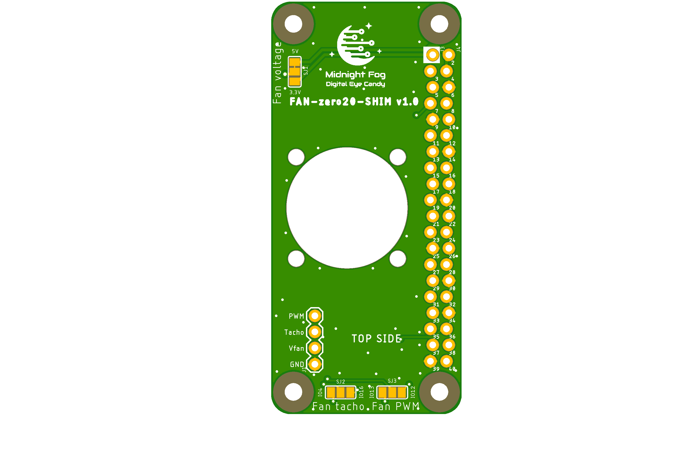
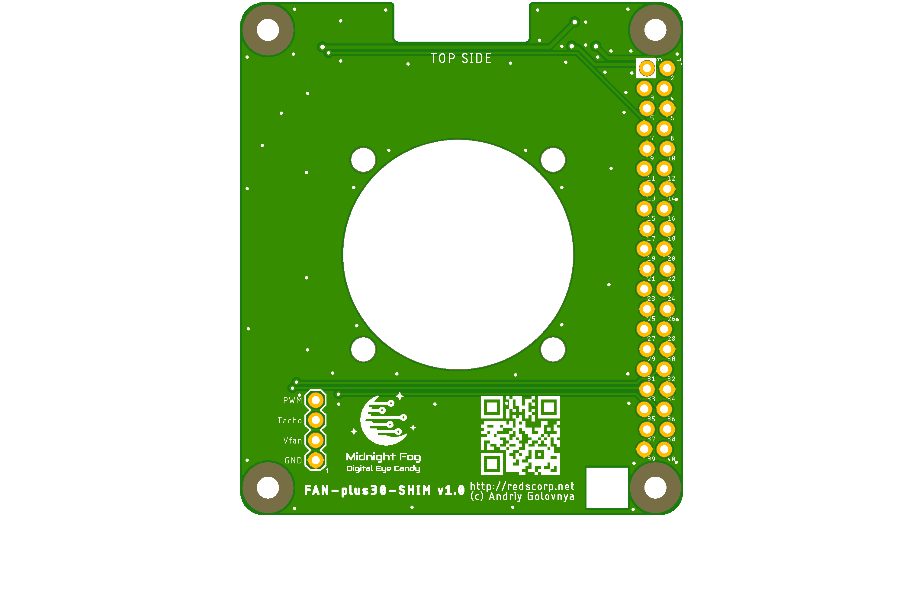

# FAN-SHIM project

FAN-SHIM (mini-HAT), support board for axial fans to cool Raspberry Pi.

Some Pis not require cooling because their CPUs are running in low performance mode.
Some Pis are good with simple passive heat sinks alone.
It's generally recommended to use active coolers, specially if you run Pi's CPU over-clocked.

This boards are designed to be used with standard axial funs with Pi's "Dupont" and standard PC's "Molex" connectors.

Some useful links:

- [pinout.xyz](https://pinout.xyz/) - a brilliant resource on topic of Pi's pinout and HATs.
- [raspberrypi/hats](https://github.com/raspberrypi/hats) - Pi's HAT specification.

## FAN-zero30-SHIM

Raspberry Pi zero 40-pin **FAN-zero30-SHIM** mini-HAT.

Preview:

[Schematics in PDF format](doc/FAN-zero30-SHIM.pdf)

Features:

- locked Pi headers
- 30mm axial fan
- 5V and 3.3V fan power selection
- fan tacho and PWM signal selection
- Pi zero board style
- can be used as SHIM (no headers) or HAT (with headers)

Pins Configuration:

|Fan Pin |Option 1 |Option 2 |
|--------|---------|---------|
|Vfan    |5V\*     |3.3V     |
|tacho   |GPIO16   |GPIO4    |
|PWM     |GPIO12   |GPIO13   |

\*) the pin is connected by default.

CAM files are available.

## FAN-zero25-SHIM

Raspberry Pi zero 40-pin **FAN-zero25-SHIM** mini-HAT.

Preview:

[Schematics in PDF format](doc/FAN-zero25-SHIM.pdf)

Features:

- locked Pi headers
- 25mm axial fan
- 5V and 3.3V fan power selection
- fan tacho and PWM signal selection
- Pi zero board style
- can be used as SHIM (no headers) or HAT (with headers)

Pins Configuration:

|Fan Pin |Option 1 |Option 2 |
|--------|---------|---------|
|Vfan    |5V\*     |3.3V     |
|tacho   |GPIO16   |GPIO4    |
|PWM     |GPIO12   |GPIO13   |

\*) the pin is connected by default.

CAM files are available.

## FAN-zero20-SHIM

Raspberry Pi zero 40-pin **FAN-zero20-SHIM** mini-HAT.

Preview:

[Schematics in PDF format](doc/FAN-zero20-SHIM.pdf)

Features:

- locked Pi headers
- 20mm axial fan
- 5V and 3.3V fan power selection
- fan tacho and PWM signal selection
- Pi zero board style
- can be used as SHIM (no headers) or HAT (with headers)

Pins Configuration:

|Fan Pin |Option 1 |Option 2 |
|--------|---------|---------|
|Vfan    |5V\*     |3.3V     |
|tacho   |GPIO16   |GPIO4    |
|PWM     |GPIO12   |GPIO13   |

\*) the pin is connected by default.

CAM files are available.

## FAN-plus40-SHIM

Raspberry Pi A+/B+ 40-pin **FAN-plus40-SHIM** mini-HAT.

Preview:

[Schematics in PDF format](doc/FAN-plus40-SHIM.pdf)

Features:

- locked Pi headers
- 40mm axial fan
- 5V and 3.3V fan power selection
- fan tacho and PWM signal selection
- Pi A+/B+ board style
- can be used as SHIM (no headers) or HAT (with headers)

Pins Configuration:

|Fan Pin |Option 1 |Option 2 |
|--------|---------|---------|
|Vfan    |5V\*     |3.3V     |
|tacho   |GPIO16   |GPIO4    |
|PWM     |GPIO12   |GPIO13   |

\*) the pin is connected by default.

CAM files are available.

## FAN-plus30-SHIM

Raspberry Pi A+/B+ 40-pin **FAN-plus30-SHIM** mini-HAT.

Preview:

[Schematics in PDF format](doc/FAN-plus30-SHIM.pdf)

Features:

- locked Pi headers
- 30mm axial fan
- 5V and 3.3V fan power selection
- fan tacho and PWM signal selection
- Pi A+/B+ board style
- can be used as SHIM (no headers) or HAT (with headers)

Pins Configuration:

|Fan Pin |Option 1 |Option 2 |
|--------|---------|---------|
|Vfan    |5V\*     |3.3V     |
|tacho   |GPIO16   |GPIO4    |
|PWM     |GPIO12   |GPIO13   |

\*) the pin is connected by default.

CAM files are available.

## How to help

Your contributions as code, resources or finances are welcome!
Please contact me directly over e-mail andriy.golovnya@gmail.com or over [GitHub profile](https://github.com/red-scorp).
Link for [Paypal donations](http://paypal.me/redscorp) and [Ko-Fi donations](http://ko-fi.com/redscorp), which are always welcome.
Thanks in advance!
